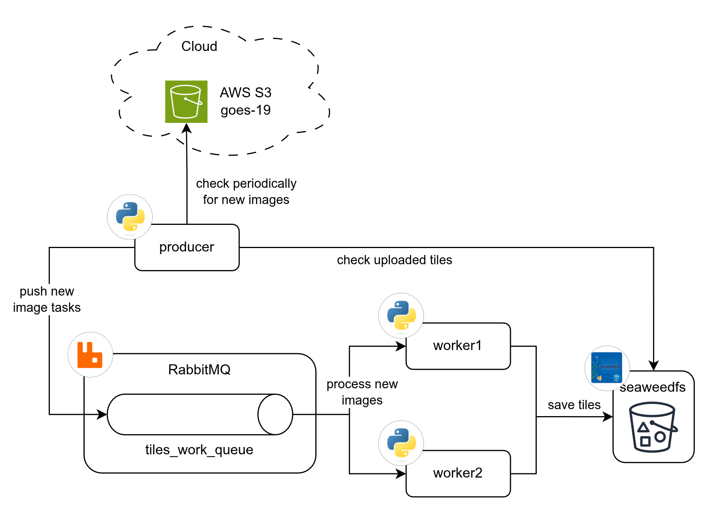
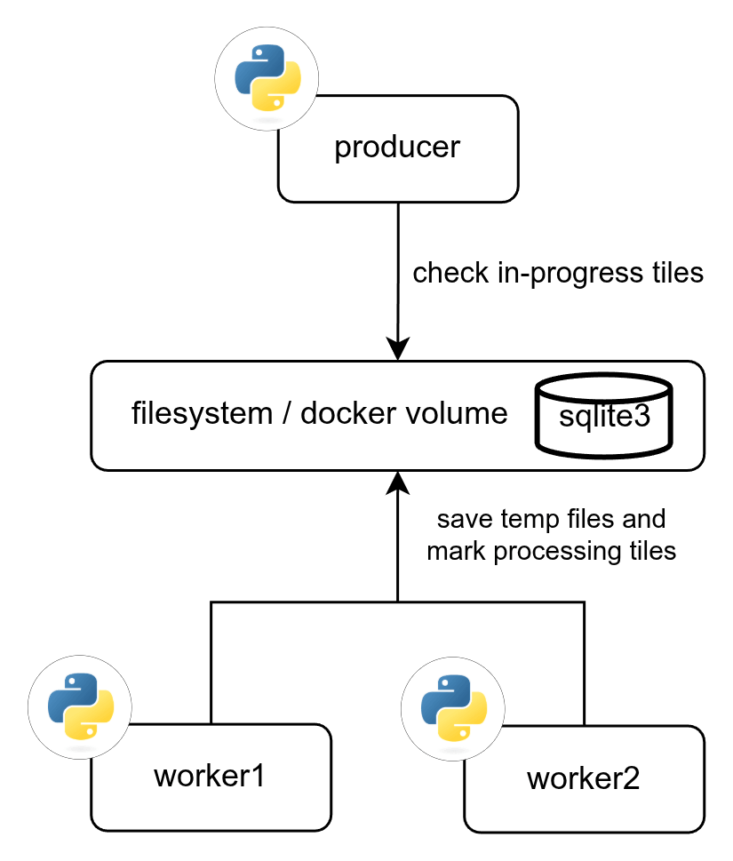
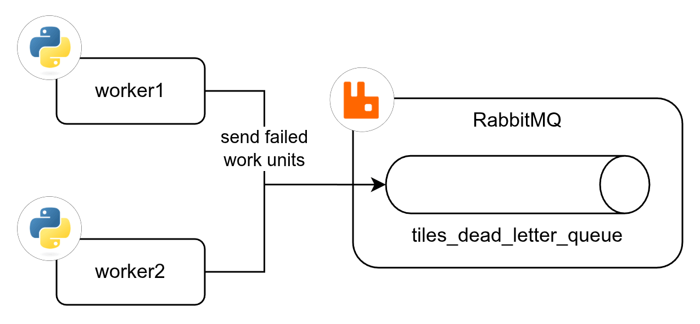

# Tiles Processor

  

Distributed Python system for processing GOES-19 satellite data from NOAA S3 — ABI radiance bands, GLM lightning detections, and local radar H5 files. Produces colorized GeoTIFFs and XYZ map tiles (WebP, zoom 3–7) stored in RustFS (S3-compatible object storage).

## Table of Contents

1. [Features](#features)
2. [Tech Stack](#tech-stack)
3. [Processing Architecture](#processing-architecture)
   1. [Diagram: General Data Flow](#general-data-flow-between-all-the-services)
   2. [Diagram: Main Flow](#tiles-processor-main-flow)
   3. [Diagram: In-Progress Check](#tiles-processor-in-progress-check)
   4. [Diagram: Dead Letter Flow](#tiles-processor-dead-letter-flow)
   5. [Workflow](#workflow)
   6. [Band Specifications](#band-specifications)
   7. [GLM Flash Extent Density Processing](#glm-flash-extent-density-fed-processing)
   8. [Recommended Execution Frequency](#recommended-execution-frequency)
   9. [File Management & Retention](#file-management--retention)
4. [S3 Storage Layout](#s3-storage-layout)
5. [Commands](#commands)
6. [Environment Variables](#environment-variables)
7. [Settings Configuration](#settings-configuration-settingsjson)

## Features

- **Satellite Data Processing**: Automatically downloads and processes GOES-19 satellite imagery.
  - **Band 13 (Clean IR Window)**: Channel 13 (10.33 µm) for Cloud Top monitoring.
  - **Band 9 (Mid-Level Water Vapor)**: Channel 9 (6.93 µm) for Water Vapor analysis.
  - **Band 2 (Visible Red)**: Channel 2 (0.64 µm) for high-resolution visible imagery (500 m native).
  - **GLM Flash Extent Density (FED)**: 10-minute lightning activity maps from 20-second L2-LCFA files.
  - **GLM Time of Event (TOE)** and **Multi-Flash Aggregation (MFA)**: Additional GLM-derived products.
  - **Radar**: Dual-pol products (DBZH, ZDR, RHOHV, KDP, VRAD) from local H5 files.
- **Queue-based Architecture**: RabbitMQ producer-worker pattern. Workers process images sequentially per worker (prefetch=1) with manual ack and a dead-letter queue for failures.
- **Subprocess Isolation**: Each image is processed in an isolated subprocess to guarantee full memory reclamation between jobs.
- **Smart Skip**: Producer checks S3 before publishing — already-processed tilesets are never re-queued.
- **Tile Retention**: per-prefix S3 lifecycle expiry rules (`tile_retention_days` in `settings.json`). Best-effort on RustFS — lifecycle support is still maturing; failures are logged and non-fatal.
- **Feature Toggles**: Individual products enabled/disabled in `settings.json`.

## Tech Stack

| Component            | Technology                  | Role                                                   |
| -------------------- | --------------------------- | ------------------------------------------------------ |
| **Language**         | Python 3.12                 | Application runtime                                    |
| **Message broker**   | RabbitMQ 4.2.4              | Work queue with DLQ, AMQP protocol                     |
| **Object storage**   | RustFS (1.0.0-beta)         | S3-compatible tile storage (standard S3 API)           |
| **Geospatial I/O**   | GDAL / rasterio / rioxarray | CRS reprojection, GeoTIFF writing, `gdal2tiles`        |
| **Scientific data**  | xarray / h5py / arm-pyart   | NetCDF/HDF5 reading, radar processing                  |
| **Async I/O**        | asyncio / aioboto3          | Non-blocking S3 and network operations                 |
| **Scheduling**       | APScheduler                 | Cron-based producer trigger                            |
| **Containerization** | Docker / Docker Compose     | Service orchestration                                  |

## Processing Architecture

### General data flow between all the services

<p align="center">
    
</p>

### Tiles processor main flow

<p align="center">
    
</p>

### Tiles processor in-progress check

<p align="center">
    
</p>

### Tiles processor dead letter flow

<p align="center">
    
</p>

### Workflow

1. **Producer** (`src/producer/`)
   - Runs on a cron schedule.
   - Scans NOAA's S3 for the latest images per enabled product.
   - Deduplicates against S3 (RustFS) — skips already-processed tilesets.
   - Publishes `WorkUnit` messages to the RabbitMQ `tiles_work_queue`.

2. **Workers** (`src/worker/`)
   - Consume one work unit at a time (prefetch=1, manual ack).
   - Each unit runs the full pipeline in an isolated subprocess:
     1. **Download** — fetch raw NetCDF from NOAA S3 to local shared volume.
     2. **Georeference** — apply geostationary projection correction.
     3. **Science** — brightness temperature (IR/WV) or reflectance (visible).
     4. **GeoTIFF** — colorize and write EPSG:4326 GeoTIFF.
     5. **Tile generation** — `gdal2tiles` → XYZ tiles (zoom 3–7).
     6. **Upload** — push tiles to RustFS (S3).
     7. **Cleanup** — delete all local temporary files.
   - Failed messages (max 3 retries) are routed to the dead-letter queue.

3. **Entry point**: `python src/main.py producer|worker`

### Band Specifications

| Aspect        | Band 13 (Cloud Tops)             | Band 9 (Water Vapor)        | Band 2 (Visible)              | GLM FED (Lightning)                 |
| ------------- | -------------------------------- | --------------------------- | ----------------------------- | ----------------------------------- |
| Wavelength    | 10.33 µm (Clean IR Window)       | 6.93 µm (Mid-Level WV)      | 0.64 µm (Red visible)         | N/A (Lightning detection)           |
| Purpose       | Cloud top temperature            | Atmospheric moisture        | High-resolution visible       | Lightning activity density          |
| Color Palette | Gray → Red                       | Maroon → Blue (SMN style)   | Grayscale                     | Yellow → Orange → Red → White       |
| Data Range    | 183.15K–323.15K (−90°C to +50°C) | 220K–260K (−53°C to −13°C)  | 0–1 reflectance               | 0–100+ flashes / 2 km cell / 10 min |
| Temporal Res. | ~10 min                          | ~10 min                     | ~10 min                       | 10 min (aggregated)                 |
| Native Res.   | 2 km (5424×5424 Full Disk)       | 10 km (1808×1808 Full Disk) | 500 m (21696×21696 Full Disk) | ~2 km (0.02° grid)                  |
| Input Files   | 1 NetCDF per product             | 1 NetCDF per product        | 1 NetCDF per product          | ~30 NetCDF files per product        |
| Output Dir    | `band_13/`                       | `band_9/`                   | `band_2/`                     | `glm_fed/`                          |

### GLM Flash Extent Density (FED) Processing

The GLM FED processor creates lightning activity maps by aggregating flash events over 10-minute time windows.

#### How 20-Second GLM Files Become 10-Minute Products

**1. Raw Data Source**

- GOES-19 GLM publishes Level 2 Lightning Cluster-Filter Algorithm (L2-LCFA) files every ~20 seconds.
- Each file contains individual flash events with coordinates (lat/lon), energy, area, etc.

**2. Time Window Discovery**

Files are grouped into 10-minute windows:

```
12:00:00 - 12:10:00  →  30 files  →  GLM_FED_s20260431200000
12:10:00 - 12:20:00  →  30 files  →  GLM_FED_s20260431201000
```

- Timestamps are parsed from filenames: `OR_GLM-L2-LCFA_G19_s20260431200400_...nc` → 12:00:40
- Rounded to 10-minute boundary: 12:00:40 → 12:00:00 window

**3. Flash Aggregation Pipeline**

For each 10-minute window:

1. **Download** all ~30 L2-LCFA files
2. **Extract** `flash_lat` / `flash_lon` from each file (~15,000 total flashes)
3. **Bin** into 2D histogram (0.02° grid cells)
4. **Colorize** using yellow→orange→red palette based on flash density
5. **Generate** single GeoTIFF for the 10-minute window
6. **Tile** with `gdal2tiles` (zoom 3–7)

#### Color Scheme

| Color         | Flash Count | Activity  |
| ------------- | ----------- | --------- |
| Faint yellow  | 0–5         | Minimal   |
| Bright yellow | 5–30        | Moderate  |
| Orange        | 30–60       | High      |
| Red           | 60–100      | Very high |
| White         | 100+        | Extreme   |

### Recommended Execution Frequency

**ABI Bands (13, 9, 2):** GOES-19 publishes Full Disk images every 10 minutes.

**GLM FED:** Files are published every ~20 seconds; the producer groups them into 10-minute windows.

| Schedule              | CRON           | Rationale                                |
| --------------------- | -------------- | ---------------------------------------- |
| Every 5 min (default) | `*/5 * * * *`  | Near real-time updates                   |
| Every 10 min          | `*/10 * * * *` | Matches satellite cadence, moderate load |
| Every 30 min          | `*/30 * * * *` | Lower resource usage, acceptable delay   |

The producer runs on a single schedule for all enabled products.

### File Management & Retention

GOES-19 files have unique names based on timestamp:

```
OR_ABI-L1b-RadF-M6C13_G19_s20250141230210_e20250141239518_c20250141239557.nc
                         └── s20250141230210 = start time (2025, day 014, 12:30:21.0 UTC)
```

- **Local**: No local retention — all temporary files (raw NetCDF, GeoTIFFs, tiles) are deleted after upload.
- **S3**: Retention controlled by `tile_retention_days` in `settings.json`. Applied as portable per-prefix S3 bucket lifecycle expiry rules on worker startup (`S3Client.configure_lifecycle_policy`). Best-effort on RustFS — if lifecycle is unsupported the call is logged and skipped (no crash).

## S3 Storage Layout

```
tiles-data/                              # Bucket name (configurable)
├── tiles/
│   ├── band_13/
│   │   └── {tileset_id}_tiles/          # One directory per processed image
│   │       └── {z}/{x}/{y}.webp         # XYZ tile structure (z=3-7)
│   ├── band_9/
│   │   └── {tileset_id}_tiles/
│   │       └── {z}/{x}/{y}.webp
│   ├── band_2/
│   │   └── {tileset_id}_tiles/
│   │       └── {z}/{x}/{y}.webp
│   ├── glm_fed/
│   │   └── GLM_FED_s{YYYYJJJHHMMSS}_tiles/  # 10-minute window tilesets
│   │       └── {z}/{x}/{y}.webp
│   └── radar/
│       └── {radar_id}/{variable}/elev{N}/{timestamp}/
│           └── {z}/{x}/{y}.webp
└── cog/
  ├── {band_id}/{image_id}.tif
  └── radar/{radar_id}/{variable}/elev{N}/{timestamp}.tif
```

**Tileset naming:**

- **ABI Bands**: Based on source filename (e.g., `OR_ABI-L1b-RadF-M6C13_G19_s20260440350212_..._tiles`)
- **GLM FED**: Based on window start time (e.g., `GLM_FED_s20260431200000_tiles` = 2026, day 43, 12:00:00 UTC)

## Commands

```bash
make up      # Start dev environment (bind mounts, hot reload)
make down    # Stop all services
make test    # Run tests with coverage
make prod    # Production build and start
make clean   # Remove Docker volumes

pytest tests/test_config.py -v     # Single test file
pytest tests/ -k "test_health"     # Pattern match
```

Code quality:

```bash
black src/ --check
pylint src --ignore-patterns="test_.*?py"
```

### Docker Compose Generator

```bash
# Production (named volumes)
./scripts/generate-compose.sh 5           # 5 workers → docker-compose.yaml

# Development (bind mounts, ./data)
./scripts/generate-compose.sh --dev 2     # 2 workers → docker-compose-dev.yaml

# Custom output filename
./scripts/generate-compose.sh 3 docker-compose-custom.yaml
```

### Object storage (RustFS)

Buckets are created automatically on startup by the one-shot `rustfs-init` service
(`aws-cli` `s3 mb` via the standard S3 API), and the app also self-creates its write
bucket via `S3Client.ensure_bucket_exists`. To inspect/manage objects, users, and access
keys, open the **RustFS Console** at `http://localhost:${RUSTFS_CONSOLE_PORT}` (default
`http://localhost:9001`), logging in with `RUSTFS_ACCESS_KEY` / `RUSTFS_SECRET_KEY`.

## Environment Variables

| Variable                                 | Description                                             | Default  |
| :--------------------------------------- | :------------------------------------------------------ | :------- |
| `LOG_LEVEL`                              | Logging verbosity (`DEBUG`, `INFO`, `WARNING`, `ERROR`) | Required |
| `DATA_DIR`                               | Container path for data files                           | Required |
| `S3_TILES_DATA_ENDPOINT`                 | RustFS S3 endpoint (`host:port`, e.g. `rustfs:9000`)    | Required |
| `S3_TILES_DATA_TILES_PROCESSOR_USER`     | S3 access key                                           | Required |
| `S3_TILES_DATA_TILES_PROCESSOR_PASSWORD` | S3 secret key                                           | Required |
| `S3_TILES_DATA_BUCKET_NAME`              | S3 bucket name                                          | Required |
| `S3_TILES_DATA_SECURE`                   | Use HTTPS for S3 (`true`/`false`)                       | `false`  |
| `RABBITMQ_HOST`                          | RabbitMQ hostname                                       | Required |
| `RABBITMQ_PORT`                          | RabbitMQ port                                           | Required |
| `RABBITMQ_USER`                          | RabbitMQ username                                       | Required |
| `RABBITMQ_PASSWORD`                      | RabbitMQ password                                       | Required |
| `RABBITMQ_QUEUE`                         | Work queue name                                         | Required |
| `RABBITMQ_DLQ`                           | Dead-letter queue name                                  | Required |
| `RABBITMQ_DLX`                           | Dead-letter exchange name                               | Required |
| `JOB_TTL_MINUTES`                        | Max age of a queued job before discard                  | Required |
| `RUSTFS_ACCESS_KEY`                      | RustFS root access key (shared by all consumers)        | Required |
| `RUSTFS_SECRET_KEY`                      | RustFS root secret key                                  | Required |
| `RUSTFS_CONSOLE_PORT`                    | Host port for the RustFS console UI (container `:9001`) | `9001`   |
| `HEALTH_PORT`                            | Port for `/health` and `/ready` endpoints               | `8080`   |

## Settings Configuration (`settings.json`)

```json
{
  "timezone": "America/Argentina/Buenos_Aires",
  "tile_retention_days": 30,
  "radar_input_dir": "/app/data/radar_h5",
  "features": {
    "enable_band_13": true,
    "enable_band_9": true,
    "enable_band_2": true,
    "enable_glm_fed": true,
    "enable_glm_toe": true,
    "enable_glm_mfa": true,
    "enable_radar_DBZH": true,
    "enable_radar_ZDR": true,
    "enable_radar_RHOHV": true,
    "enable_radar_KDP": true,
    "enable_radar_VRAD": true
  },
  "bounds": {
    "minx": -110.0,
    "miny": -60.0,
    "maxx": -30.0,
    "maxy": -15.0
  }
}
```

- **`tile_retention_days`**: applied as per-prefix S3 bucket lifecycle expiry rules (best-effort on RustFS).
- **`features`**: Enable/disable individual products without restarting containers.
- **`bounds`**: Geographic clip region in EPSG:4326. Applied to all outputs.
- **`radar_input_dir`**: Directory scanned for `.H5` radar files.

## Generating Secure Credentials

```bash
docker run --rm -it python:3-alpine sh -c "python -c 'import secrets; print(secrets.token_urlsafe(32))'"
```
