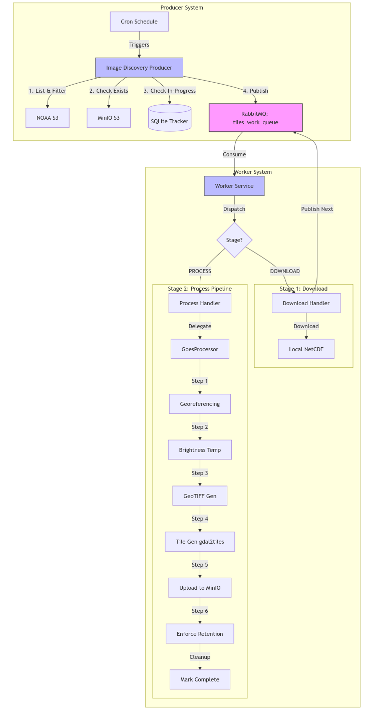

# Tiles Processor

  

This project is a Python-based scheduler application designed to process GOES-19 satellite imagery. It automates the retrieval of ABI-L1b-RadF products (Full Disk Radiance) from an S3 bucket, processes specific spectral bands to compute brightness temperatures, and generates GeoTIFFs and map tiles for visualization.

## Features

- **Satellite Data Processing**: Automatically downloads and processes GOES-19 satellite imagery.
  - **Band 13 (Clean IR Window)**: Processes Channel 13 (10.33 µm) for Cloud Top monitoring.
  - **Band 9 (Mid-Level Water Vapor)**: Processes Channel 9 (6.93 µm) for Water Vapor analysis.
  - **Band 2 (Visible Red)**: Processes Channel 2 (0.64 µm) for high-resolution visible imagery.
  - **GLM Flash Extent Density (FED)**: Processes Geostationary Lightning Mapper data to create 10-minute lightning activity maps.
- **Job Management**:
  - **Queuing System**: Jobs are triggered by CRON schedules but are added to a processing queue. A background worker processes jobs sequentially to prevent resource overload.
  - **Feature Toggles**: Individual products (Band 13, Band 9, Band 2, GLM FED, Radar) can be enabled or disabled via `settings.json`.
  - **Smart Execution**:
    - **Immediate First Run**: New deployments trigger a separate one-off execution immediately, then follow the recurring schedule.
    - **Persistence**: Job state is saved to SQLite, ensuring the schedule survives application restarts.
- **Optimized Processing**:
  - **Smart Caching**: Checks local disk before downloading from S3.
  - **Skip Logic**: Skips the entire processing pipeline if the final tiles already exist for a file.
  - **Auto-Cleanup**: Automatically deletes raw `.nc` and intermediate `.tif` files, retaining only the last 26 images to minimize disk usage while maintaining an effective cache.
- **Safety Limits**: Prevents job execution if the temporary directory size exceeds 10GB (`MAX_TMP_DIR_SIZE_BYTES`) to avoid disk overflow.
- **Dockerized**: Fully containerized environment for easy deployment.
- **Scheduler**: Uses `APScheduler` for precise job scheduling (cron-based).

## Processing Architecture

The system uses a robust queue-based architecture powered by **RabbitMQ** to manage high-volume satellite data processing. Reliability and scalability are achieved through a producer-worker pattern.



### Workflow

1.  **Discovery (Producer)**
    - Runs on a cron schedule.
    - Scans NOAA's S3 bucket for the latest images.
    - Checks MinIO to skip already processed images.
    - Publishes `DOWNLOAD` tasks to the RabbitMQ `tiles_work_queue`.

2.  **Download Stage (Worker)**
    - A worker picks up a `DOWNLOAD` task.
    - Downloads the raw NetCDF file from NOAA to a local shared volume.
    - Publishes a new `PROCESS` task to the queue with the path to the downloaded file.

3.  **Process Stage (Worker)**
    - A worker picks up a `PROCESS` task.
    - Executes the synchronous processing pipeline:
      1.  **Georeference**: Applies projection correction to the raw data.
      2.  **Brightness Temp**: Converts radiance to brightness temperature (Kelvin).
      3.  **GeoTIFF**: Generates a colorized GeoTIFF (EPSG:4326).
      4.  **Tile Generation**: Runs `gdal2tiles` to create XYZ Protocol map tiles.
      5.  **Upload**: Uploads the generated tiles to MinIO.
      6.  **Cleanup**: Deletes local temporary files and enforces retention policy (keeps last 26 sets).

### Band Specifications

| Aspect        | Band 13 (Cloud Tops)               | Band 9 (Water Vapor)         | GLM FED (Lightning)                    |
| ------------- | ---------------------------------- | ---------------------------- | -------------------------------------- |
| Wavelength    | 10.33 µm (Clean IR Window)         | 6.93 µm (Mid-Level WV)       | N/A (Lightning detection)              |
| Purpose       | Cloud top temperature              | Atmospheric moisture         | Lightning activity density             |
| Color Palette | Gray → Red                         | Maroon → Blue (SMN style)    | Yellow → Orange → Red → White          |
| Data Range    | 183.15K - 323.15K (-90°C to +50°C) | 220K - 260K (-53°C to -13°C) | 0-100+ flashes per 2km cell per 10 min |
| Temporal Res. | ~10 min (single snapshot)          | ~10 min (single snapshot)    | 10 min (aggregated window)             |
| Input Files   | 1 NetCDF per product               | 1 NetCDF per product         | ~30 NetCDF files per product           |
| Spatial Res.  | ~2 km (after resampling)           | ~10 km (after resampling)    | ~2 km (0.02° grid)                     |
| Output Dir    | `.tmp/band_13/`                    | `.tmp/band_9/`               | `.tmp/glm_fed/`                        |

### GLM Flash Extent Density (FED) Processing

The GLM FED processor creates lightning activity maps by aggregating flash events over 10-minute time windows.

#### How 20-Second GLM Files Become 10-Minute Products

**1. Raw Data Source**

- GOES-19 GLM publishes Level 2 Lightning Cluster-Filter Algorithm (L2-LCFA) files every ~20 seconds
- Each file contains individual flash events with coordinates (lat/lon), energy, area, etc.
- Covers full disk (entire hemisphere visible from satellite)

**2. Time Window Discovery**
The data source groups files into 10-minute windows:

```
12:00:00 - 12:10:00  →  30 files  →  GLM_FED_s20260431200000
12:10:00 - 12:20:00  →  30 files  →  GLM_FED_s20260431201000
```

**Process:**

- Parse timestamps from filenames: `OR_GLM-L2-LCFA_G19_s20260431200400_...nc` → 12:00:40
- Round to 10-minute boundary: 12:00:40 → 12:00:00 window
- Group all files in same window together

**3. Flash Aggregation Pipeline**

For each 10-minute window:

1. **Download**: All ~30 L2-LCFA files (600 seconds ÷ 20 seconds/file)
2. **Extract**: Read `flash_lat` and `flash_lon` from all files
   - Example: File 1 has 520 flashes, File 2 has 487 flashes, ... → Total: ~15,000 flashes
3. **Bin**: Create 2D histogram in 0.02° grid cells
   ```python
   flash_counts[cell] = number of flashes in that 2km × 2km area
   ```
4. **Colorize**: Apply yellow→orange→red palette based on flash density
5. **Generate**: Single GeoTIFF representing entire 10-minute period
6. **Tile**: Create XYZ tiles (zoom 3-7) using gdal2tiles

**Result**: One tileset per 10-minute window showing cumulative lightning activity

#### Visual Example

```
Time Window: 12:00:00 - 12:10:00
────────────────────────────────────────────────────────────────
Individual Files (20s each):
  12:00:00-12:00:20  520 flashes  ┐
  12:00:20-12:00:40  487 flashes  │
  12:00:40-12:01:00  512 flashes  │
  ...                ...          ├─► Aggregate into single grid
  12:09:20-12:09:40  498 flashes  │   Count flashes per 2km cell
  12:09:40-12:10:00  512 flashes  ┘   Apply density colormap

Output: GLM_FED_s20260431200000_tiles/
        Single tileset showing 10-minute flash density
```

#### Color Scheme

- **Transparent/Faint Yellow**: 0-5 flashes (minimal activity)
- **Bright Yellow**: 5-30 flashes (moderate activity)
- **Orange**: 30-60 flashes (high activity)
- **Red**: 60-100 flashes (very high activity)
- **White**: 100+ flashes (extreme activity - rare)

### Recommended Execution Frequency

**ABI Bands (13, 9, 2):** GOES-19 publishes Full Disk images **every 10 minutes**. The producer discovers the latest 26 images (4+ hours of data).

**GLM FED:** GLM files are published every ~20 seconds. The producer groups them into 10-minute windows and discovers the latest 26 windows (4+ hours of data).

| Schedule                      | CRON           | Rationale                                |
| ----------------------------- | -------------- | ---------------------------------------- |
| **Every 5 min** (recommended) | `*/5 * * * *`  | Near real-time updates, default schedule |
| Every 10 min                  | `*/10 * * * *` | Matches satellite cadence, moderate load |
| Every 30 min                  | `*/30 * * * *` | Lower resource usage, acceptable delay   |

**Note:** The producer runs on a single schedule for all enabled products. Individual products can be toggled on/off via `settings.json`.

### File Management & Retention

GOES-19 files have unique names based on timestamp:

```
OR_ABI-L1b-RadF-M6C13_G19_s20250141230210_e20250141239518_c20250141239557.nc
                         └── s20250141230210 = start time (2025, day 014, 12:30:21.0 UTC)
```

**Optimization Strategy**:

- **Smart Skip**: If tiles exist in S3 (checked via `exists_in_s3`), the system **skips** downloading and processing that file entirely.
- **Retention Policy**:
  - **Local**: No local retention. All temporary files (raw NetCDF, GeoTIFFs, and tiles) are deleted after successful upload to S3 to minimize ephemeral storage usage.
  - **S3 (Source of Truth)**: The S3 bucket retains the **newest 26 tilesets** (approx 4.3 hours) per band.
  - **S3 Cleanup**: A rolling window cleanup is triggered at the end of every job to delete S3 prefixes older than the newest 26.
- **Cleanup**: executed via `_perform_cleanup` which clears local directories and prunes S3.

## MinIO S3 Storage

The tiles-processor uploads generated tiles to a MinIO S3 bucket for consumption by other services (e.g., data-service). This decouples tile generation from tile serving and enables horizontal scaling.

### S3 Bucket Structure

```
tiles-data/                              # Bucket name (configurable)
├── band_13/
│   └── tiles/
│       └── {tileset_id}_tiles/          # One directory per processed image
│           └── {z}/{x}/{y}.webp         # XYZ tile structure (z=3-7)
├── band_9/
│   └── tiles/
│       └── {tileset_id}_tiles/
│           └── {z}/{x}/{y}.webp
├── band_2/
│   └── tiles/
│       └── {tileset_id}_tiles/
│           └── {z}/{x}/{y}.webp
└── glm_fed/
    └── tiles/
        └── GLM_FED_s{YYYYJJJHHMMSS}_tiles/  # 10-minute window tilesets
            └── {z}/{x}/{y}.webp              # Example: GLM_FED_s20260431200000_tiles
```

**Tileset Naming:**

- **ABI Bands**: Based on source filename (e.g., `OR_ABI-L1b-RadF-M6C13_G19_s20260440350212_..._tiles`)
- **GLM FED**: Based on window start time (e.g., `GLM_FED_s20260431200000_tiles` = 2026, day 43, 12:00:00 UTC)

**MinIO Internal Storage:**
Each `.webp` tile is stored as a directory containing an `xl.meta` file (MinIO's erasure-coded format). When accessed via S3 API, these appear as normal objects at paths like:

```
s3://tiles-data/glm_fed/tiles/GLM_FED_s20260431200000_tiles/7/35/69.webp
```

### MinIO Service

The docker-compose includes a MinIO service that:

- Exposes S3 API on port `9000` (configurable via `S3_TILES_DATA_PORT`)
- Exposes Web Console on port `9001` (configurable via `MINIO_CONSOLE_PORT`)

To configure the bucket, run the setup script after starting the services:

```bash
./scripts/setup_minio.sh
```

This script will:

- Create the `tiles-data` bucket
- Set public read access on the bucket for tile serving

**MinIO Console**: `http://localhost:9001` (default credentials: `minioadmin`/`minioadmin`)

### Integration with data-service

The data-service connects to the same MinIO instance to sync and serve tiles via REST API. When running both services:

1. tiles-processor MinIO is exposed on ports 9000/9001
2. data-service connects using `MINIO_ENDPOINT=<host>:9000`

## Commands

| Command     | Description                                         |
| :---------- | :-------------------------------------------------- |
| `make up`   | Start the application in detached mode.             |
| `make down` | Stop the application.                               |
| `make prod` | Build and start the application in production mode. |
| `make test` | Run unit tests.                                     |

### Docker Compose Generator

The project includes a script to generate docker-compose files with a configurable number of workers:

```bash
# Generate production docker-compose with 5 workers
./scripts/generate-compose.sh 5

# Generate development docker-compose with 2 workers
./scripts/generate-compose.sh --dev 2

# Generate with custom output filename
./scripts/generate-compose.sh 3 docker-compose-custom.yaml
./scripts/generate-compose.sh --dev 3 docker-compose-dev-custom.yaml
```

| Mode                  | Default Output            | Data Volumes           | Healthcheck Retries |
| --------------------- | ------------------------- | ---------------------- | ------------------- |
| Production (default)  | `docker-compose.yaml`     | Named volumes          | 20                  |
| Development (`--dev`) | `docker-compose-dev.yaml` | Bind mounts (`./data`) | 3-15                |

## Generating Secure Credentials

To generate secure passwords or access keys for your `.env` file, you can run the following command (requires Docker):

```bash
docker run --rm -it python:3-alpine sh -c "python -c 'import secrets; print(\"Generated Credential:\", secrets.token_urlsafe(32))'"
```

## Environment Variables

| Variable                    | Description                                             | Default      |
| :-------------------------- | :------------------------------------------------------ | :----------- |
| `LOG_LEVEL`                 | Logging verbosity (DEBUG, INFO, WARNING, ERROR).        | `INFO`       |
| `TZ`                        | Timezone for the scheduler.                             | `UTC`        |
| `BAND_13_SCHEDULE_CRON`     | Cron expression for Band 13 job (validated at startup). | Required     |
| `BAND_9_SCHEDULE_CRON`      | Cron expression for Band 9 job (validated at startup).  | Required     |
| `ENABLE_BAND_13`            | Enable/Disable Band 13 processing (`true`/`false`).     | `true`       |
| `ENABLE_BAND_9`             | Enable/Disable Band 9 processing (`true`/`false`).      | `true`       |
| `DATA_DIR_HOST`             | Local path for data files (host).                       | `./data`     |
| `DATA_DIR`                  | Container path for data files.                          | `/app/data`  |
| `BOUNDS_MINX`               | West longitude for clipping (EPSG:4326).                | `-90.0`      |
| `BOUNDS_MINY`               | South latitude for clipping (EPSG:4326).                | `-60.0`      |
| `BOUNDS_MAXX`               | East longitude for clipping (EPSG:4326).                | `-30.0`      |
| `BOUNDS_MAXY`               | North latitude for clipping (EPSG:4326).                | `-15.0`      |
| `S3_TILES_DATA_ENDPOINT`    | MinIO/S3 endpoint (host:port).                          | Required     |
| `S3_TILES_DATA_ACCESS_KEY`  | S3 access key (username).                               | `minioadmin` |
| `S3_TILES_DATA_SECRET_KEY`  | S3 secret key (password).                               | `minioadmin` |
| `S3_TILES_DATA_BUCKET_NAME` | S3 bucket name for tile storage.                        | `tiles-data` |
| `S3_TILES_DATA_SECURE`      | Use HTTPS for S3 connection (`true`/`false`).           | `false`      |
| `S3_TILES_DATA_PORT`        | Host port for MinIO S3 API (if using Docker).           | `9000`       |
| `MINIO_CONSOLE_PORT`        | Host port for MinIO Web Console (if using Docker).      | `9001`       |

## Settings Configuration (settings.json)

Feature toggles and geographic bounds are configured in `settings.json`:

```json
{
  "timezone": "America/Argentina/Buenos_Aires",
  "features": {
    "enable_band_13": true,
    "enable_band_9": true,
    "enable_band_2": true,
    "enable_glm_fed": true,
    "enable_radar": false
  },
  "bounds": {
    "minx": -90.0,
    "miny": -60.0,
    "maxx": -30.0,
    "maxy": -15.0
  }
}
```

**Feature Toggles:**

- `enable_band_13`: Enable/disable Band 13 (Cloud Tops) processing
- `enable_band_9`: Enable/disable Band 9 (Water Vapor) processing
- `enable_band_2`: Enable/disable Band 2 (Visible) processing
- `enable_glm_fed`: Enable/disable GLM Flash Extent Density processing
- `enable_radar`: Enable/disable Radar processing (experimental)

**Geographic Bounds:**
Configure the region of interest (EPSG:4326 coordinates):

- `minx`: West longitude (e.g., -90.0 = 90°W)
- `miny`: South latitude (e.g., -60.0 = 60°S)
- `maxx`: East longitude (e.g., -30.0 = 30°W)
- `maxy`: North latitude (e.g., -15.0 = 15°S)

## Radar Processing

The repository also contains tools for processing radar data:

- `radar_to_tiles.py`: Converts H5 radar files to map tiles.
- `explore_radar.py`: A script to inspect H5 radar files structure and metadata.
