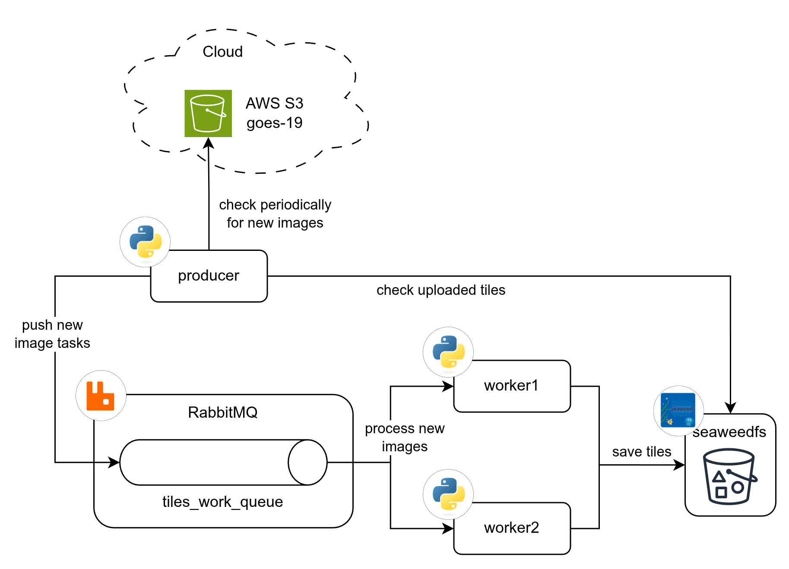
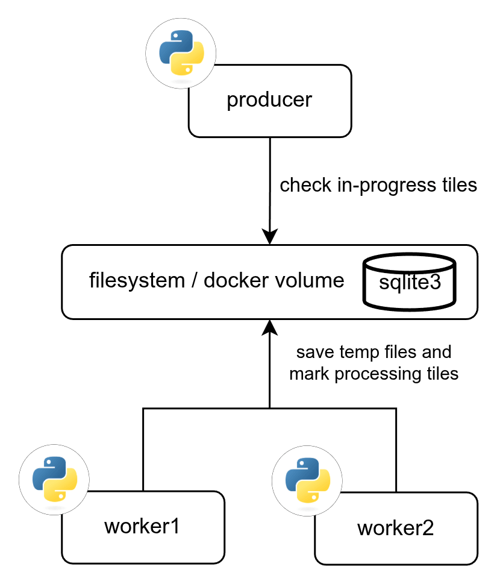
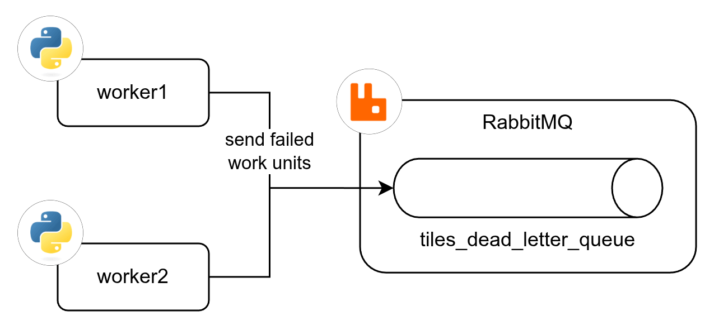

# Tiles Processor

  

Distributed Python system for processing GOES-19 satellite data from NOAA S3 — ABI radiance bands, GLM lightning detections, and local radar H5 files. Produces colorized GeoTIFFs and XYZ map tiles (WebP, zoom 3–7) stored in SeaweedFS.

## Table of Contents

1. [Features](#features)
2. [Tech Stack](#tech-stack)
3. [Processing Architecture](#processing-architecture)
   1. [Diagram: General Data Flow](#general-data-flow-between-all-the-services)
   2. [Diagram: Main Flow](#tiles-processor-main-flow)
   3. [Diagram: In-Progress Check](#tiles-processor-in-progress-check)
   4. [Diagram: Dead Letter Flow](#tiles-processor-dead-letter-flow)
   5. [Workflow](#workflow)
   6. [Band Specifications](#band-specifications)
   7. [GLM Flash Extent Density Processing](#glm-flash-extent-density-fed-processing)
   8. [Recommended Execution Frequency](#recommended-execution-frequency)
   9. [File Management & Retention](#file-management--retention)
4. [S3 Storage Layout](#s3-storage-layout)
5. [Commands](#commands)
6. [Environment Variables](#environment-variables)
7. [Settings Configuration](#settings-configuration-settingsjson)

## Features

**Products.** Each one is colorized and tiled as its own tileset:

- **Band 13 (Clean IR Window).** Channel 13 (10.33 µm), cloud top monitoring.
- **Band 9 (Mid-Level Water Vapor).** Channel 9 (6.93 µm), water vapor analysis.
- **Band 2 (Visible Red).** Channel 2 (0.64 µm), high-resolution visible imagery (500 m native).
- **GLM Flash Extent Density (FED).** 10-minute lightning activity maps from 20-second L2-LCFA files.
- **GLM Time of Event (TOE)** and **Multi-Flash Aggregation (MFA).** Further GLM-derived products.
- **Radar.** Dual-pol products (`dbzh`, `zdr`, `rhohv`, `kdp`, `vrad`) from local H5 files, plus
  **`dbzh-450km`** — the same 0.55° reflectivity read from the long-range subvolume 04
  (~445 km reach, single sweep) and published as its own product.

**Queue.** The producer publishes `WorkUnit` messages to RabbitMQ; each worker takes
one image at a time (prefetch=1), acks manually, and failures go to a dead-letter queue.

**Subprocess isolation.** Each image is processed in an isolated subprocess, so its
memory is reclaimed in full between jobs.

**Deduplication.** The producer checks S3 before publishing — already-processed
tilesets are never re-queued.

**Tile retention.** One S3 bucket lifecycle rule per output prefix, from
`sources.<name>.retention_days` in `settings.json`.

**Feature toggles.** Individual products enabled/disabled in `settings.json`.

## Tech Stack

| Component            | Technology                  | Role                                                   |
| -------------------- | --------------------------- | ------------------------------------------------------ |
| **Language**         | Python 3.12                 | Application runtime                                    |
| **Message broker**   | RabbitMQ 4.2.4              | Work queue with DLQ, AMQP protocol                     |
| **Object storage**   | SeaweedFS 4.17              | S3-compatible tile storage with built-in TTL via filer |
| **Geospatial I/O**   | GDAL / rasterio / rioxarray | CRS reprojection, GeoTIFF writing, `gdal2tiles`        |
| **Scientific data**  | xarray / h5py / arm-pyart   | NetCDF/HDF5 reading, radar processing                  |
| **Async I/O**        | asyncio / aioboto3          | Non-blocking S3 and network operations                 |
| **Scheduling**       | APScheduler                 | Cron-based producer trigger                            |
| **Containerization** | Docker / Docker Compose     | Service orchestration                                  |

## Processing Architecture

### General data flow between all the services

<p align="center">
    
</p>

### Tiles processor main flow

<p align="center">
    
</p>

### Tiles processor in-progress check

<p align="center">
    
</p>

### Tiles processor dead letter flow

<p align="center">
    
</p>

### Workflow

1. **Producer** (`src/producer/`)
   - Runs on a cron schedule.
   - Scans NOAA's S3 for the latest images per enabled product.
   - Deduplicates against SeaweedFS — skips already-processed tilesets.
   - Publishes `WorkUnit` messages to the RabbitMQ `tiles_work_queue`.

2. **Workers** (`src/worker/`)
   - Consume one work unit at a time (prefetch=1, manual ack).
   - Each unit runs the full pipeline in an isolated subprocess:
     1. **Download** — fetch raw NetCDF from NOAA S3 to local shared volume.
     2. **Georeference** — apply geostationary projection correction.
     3. **Science** — brightness temperature (IR/WV) or reflectance (visible).
     4. **GeoTIFF** — colorize and write EPSG:4326 GeoTIFF.
     5. **Tile generation** — `gdal2tiles` → XYZ tiles (zoom 3–7).
     6. **Upload** — push tiles to SeaweedFS/MinIO.
     7. **Cleanup** — delete all local temporary files.
   - Failed messages (max 3 retries) are routed to the dead-letter queue.

3. **Entry point**: `python src/main.py producer|worker`

### Band Specifications

| Aspect        | Band 13 (Cloud Tops)             | Band 9 (Water Vapor)        | Band 2 (Visible)              | GLM FED (Lightning)                 |
| ------------- | -------------------------------- | --------------------------- | ----------------------------- | ----------------------------------- |
| Wavelength    | 10.33 µm (Clean IR Window)       | 6.93 µm (Mid-Level WV)      | 0.64 µm (Red visible)         | N/A (Lightning detection)           |
| Purpose       | Cloud top temperature            | Atmospheric moisture        | High-resolution visible       | Lightning activity density          |
| Color Palette | Gray → Red                       | Maroon → Blue (SMN style)   | Grayscale                     | Yellow → Orange → Red → White       |
| Data Range    | 183.15K–323.15K (−90°C to +50°C) | 220K–260K (−53°C to −13°C)  | 0–1 reflectance               | 0–100+ flashes / 2 km cell / 10 min |
| Temporal Res. | ~10 min                          | ~10 min                     | ~10 min                       | 10 min (aggregated)                 |
| Native Res.   | 2 km (5424×5424 Full Disk)       | 10 km (1808×1808 Full Disk) | 500 m (21696×21696 Full Disk) | ~2 km (0.02° grid)                  |
| Input Files   | 1 NetCDF per product             | 1 NetCDF per product        | 1 NetCDF per product          | ~30 NetCDF files per product        |
| Output Dir    | `goes19/abi/c13/`                | `goes19/abi/c09/`           | `goes19/abi/c02/`             | `goes19/glm/fed/`                   |

### GLM Flash Extent Density (FED) Processing

The GLM FED processor creates lightning activity maps by aggregating flash events over 10-minute time windows.

#### How 20-Second GLM Files Become 10-Minute Products

**1. Raw Data Source**

- GOES-19 GLM publishes Level 2 Lightning Cluster-Filter Algorithm (L2-LCFA) files every ~20 seconds.
- Each file contains individual flash events with coordinates (lat/lon), energy, area, etc.

**2. Time Window Discovery**

Files are grouped into 10-minute windows:

```
12:00:00 - 12:10:00  →  30 files  →  GLM_FED_s20260431200000
12:10:00 - 12:20:00  →  30 files  →  GLM_FED_s20260431201000
```

- Timestamps are parsed from filenames: `OR_GLM-L2-LCFA_G19_s20260431200400_...nc` → 12:00:40
- Rounded to 10-minute boundary: 12:00:40 → 12:00:00 window

**3. Flash Aggregation Pipeline**

For each 10-minute window:

1. **Download** all ~30 L2-LCFA files
2. **Extract** `flash_lat` / `flash_lon` from each file (~15,000 total flashes)
3. **Bin** into 2D histogram (0.02° grid cells)
4. **Colorize** using yellow→orange→red palette based on flash density
5. **Generate** single GeoTIFF for the 10-minute window
6. **Tile** with `gdal2tiles` (zoom 3–7)

#### Color Scheme

| Color         | Flash Count | Activity  |
| ------------- | ----------- | --------- |
| Faint yellow  | 0–5         | Minimal   |
| Bright yellow | 5–30        | Moderate  |
| Orange        | 30–60       | High      |
| Red           | 60–100      | Very high |
| White         | 100+        | Extreme   |

### Recommended Execution Frequency

**ABI Bands (13, 9, 2):** GOES-19 publishes Full Disk images every 10 minutes.

**GLM FED:** Files are published every ~20 seconds; the producer groups them into 10-minute windows.

| Schedule              | CRON           | Rationale                                |
| --------------------- | -------------- | ---------------------------------------- |
| Every 5 min (default) | `*/5 * * * *`  | Near real-time updates                   |
| Every 10 min          | `*/10 * * * *` | Matches satellite cadence, moderate load |
| Every 30 min          | `*/30 * * * *` | Lower resource usage, acceptable delay   |

The producer runs on a single schedule for all enabled products.

### File Management & Retention

GOES-19 files have unique names based on timestamp:

```
OR_ABI-L1b-RadF-M6C13_G19_s20250141230210_e20250141239518_c20250141239557.nc
                         └── s20250141230210 = start time (2025, day 014, 12:30:21.0 UTC)
```

- **Local**: No local retention — all temporary files (raw NetCDF, GeoTIFFs, tiles) are deleted after upload.
- **S3**: Retention controlled by `sources.<name>.retention_days` in `settings.json` (default: 1 day). Applied at worker boot as one S3 bucket lifecycle expiration rule per output prefix (`models/lifecycle_config.py`).

## S3 Storage Layout

```
tiles-data/                              # Bucket name (configurable)
├── tiles/
│   ├── goes19/abi/c13/
│   │   └── {tileset_id}_tiles/          # One directory per processed image
│   │       └── {z}/{x}/{y}.webp         # XYZ tile structure (z=3-7)
│   ├── goes19/abi/c09/
│   │   └── {tileset_id}_tiles/
│   │       └── {z}/{x}/{y}.webp
│   ├── goes19/abi/c02/
│   │   └── {tileset_id}_tiles/
│   │       └── {z}/{x}/{y}.webp
│   ├── goes19/glm/fed/
│   │   └── GLM_FED_s{YYYYJJJHHMMSS}_tiles/  # 10-minute window tilesets
│   │       └── {z}/{x}/{y}.webp
│   └── radar/sinarame/
│       └── {radar_id}/{product_id}/elev{N}/{timestamp}/
│           └── {z}/{x}/{y}.webp
└── cog/
  ├── goes19/{abi/c13|abi/c09|abi/c02|glm/fed|glm/toe|glm/mfa}/{image_id}.tif
  └── radar/sinarame/{radar_id}/{product_id}/elev{N}/{timestamp}.tif
```

**Tileset naming:**

- **ABI Bands**: Based on source filename (e.g., `OR_ABI-L1b-RadF-M6C13_G19_s20260440350212_..._tiles`)
- **GLM FED**: Based on window start time (e.g., `GLM_FED_s20260431200000_tiles` = 2026, day 43, 12:00:00 UTC)

## Commands

```bash
make up         # Start dev environment (bind mounts, hot reload)
make beta1      # Start the beta-1 light preset (fewer workers, settings-beta-1.json)
make down       # Stop all services, every compose file
make beta1-down # Stop just the beta-1 stack
make test       # Run tests with coverage
make prod       # Production build and start
make clean      # Remove Docker volumes

pytest tests/test_config.py -v     # Single test file
pytest tests/ -k "test_health"     # Pattern match
```

Code quality:

```bash
black src/ --check
pylint src --ignore-patterns="test_.*?py"
```

### Docker Compose Generator

```bash
# Production (named volumes)
./scripts/generate-compose.sh 5           # 5 workers → docker-compose.yaml

# Development (bind mounts, ./data)
./scripts/generate-compose.sh --dev 2     # 2 workers → docker-compose-dev.yaml

# Custom output filename
./scripts/generate-compose.sh 3 docker-compose-custom.yaml
```

### MinIO Setup

```bash
./scripts/setup_minio.sh    # Create bucket + set public read access
```

MinIO Console: `http://localhost:9001`

## Environment Variables

| Variable                                 | Description                                             | Default  |
| :--------------------------------------- | :------------------------------------------------------ | :------- |
| `LOG_LEVEL`                              | Logging verbosity (`DEBUG`, `INFO`, `WARNING`, `ERROR`) | Required |
| `DATA_DIR`                               | Container path for data files                           | Required |
| `S3_TILES_DATA_ENDPOINT`                 | SeaweedFS/MinIO S3 endpoint (`host:port`)               | Required |
| `S3_TILES_DATA_TILES_PROCESSOR_USER`     | S3 access key                                           | Required |
| `S3_TILES_DATA_TILES_PROCESSOR_PASSWORD` | S3 secret key                                           | Required |
| `S3_TILES_DATA_BUCKET_NAME`              | S3 bucket name                                          | Required |
| `S3_TILES_DATA_SECURE`                   | Use HTTPS for S3 (`true`/`false`)                       | `false`  |
| `RABBITMQ_HOST`                          | RabbitMQ hostname                                       | Required |
| `RABBITMQ_PORT`                          | RabbitMQ port                                           | Required |
| `RABBITMQ_USER`                          | RabbitMQ username                                       | Required |
| `RABBITMQ_PASSWORD`                      | RabbitMQ password                                       | Required |
| `RABBITMQ_QUEUE`                         | Work queue name                                         | Required |
| `RABBITMQ_DLQ`                           | Dead-letter queue name                                  | Required |
| `RABBITMQ_DLX`                           | Dead-letter exchange name                               | Required |
| `JOB_TTL_MINUTES`                        | Max age of a queued job before discard                  | Required |
| `SEAWEEDFS_FILER_ENDPOINT`               | SeaweedFS Filer endpoint (optional)                     | —        |
| `SEAWEEDFS_TILE_TTL`                     | TTL for uploaded tiles (e.g. `30d`)                     | `1m`     |
| `HEALTH_PORT`                            | Port for `/health` and `/ready` endpoints               | `8080`   |

## Settings Configuration (`settings.json`)

Top-level keys are the globals (`timezone`, `bounds`) and the `metrics` block;
everything else is grouped per data source under `sources.<name>`, so a source's
input, product toggles, retention, and tuning live together.

```json
{
  "timezone": "America/Argentina/Buenos_Aires",
  "bounds": { "minx": -110.0, "miny": -60.0, "maxx": -30.0, "maxy": -15.0 },
  "metrics": { "enabled": true, "max_rows": 1000000 },
  "scheduler": { "discovery_cron": "*/5 * * * *" },
  "sources": {
    "goes19-abi": {
      "input": { "mode": "s3", "s3_bucket": "noaa-goes19" },
      "products": { "c13": true, "c09": true, "c02": true },
      "target_images": 24,
      "max_hours_back": 5,
      "retention_days": 1
    },
    "goes19-glm": {
      "input": { "mode": "local", "dir": "/app/data/glm_h5" },
      "accum_minutes": 10,
      "produce_every_minutes": 10,
      "safety_lag_seconds": 30,
      "target_windows": 24,
      "products": { "fed": true, "toe": true, "mfa": true },
      "retention_days": 1
    },
    "radar-sinarame": {
      "input": { "mode": "local", "dir": "/app/data/radar_h5" },
      "stations": "all",
      "products": {
        "dbzh": true, "dbzh-450km": true, "zdr": true,
        "rhohv": true, "kdp": true, "vrad": true
      },
      "target_images": 12,
      "zoom_levels": "4-9",
      "light_queue": "all",
      "retention_days": 1
    },
    "wrf-arg4k": {
      "input": { "mode": "local", "dir": "/app/data/wrf_nc" },
      "products": { "colmax": true, "granizo": true },
      "target_runs": 3,
      "light_queue": "all",
      "retention_days": 2
    },
    "ecmwf-ifs": {
      "input": { "mode": "external-provider-opendata" },
      "products": { "total-precipitation": true, "mean-sea-level-pressure": true },
      "mean-sea-level-pressure": { "isobar_simplify_tolerance": 0.05, "smoothing_sigma": 1.5 },
      "retention_days": { "default": 2, "grib": 1 }
    },
    "gfs": {
      "input": { "mode": "external-provider-nomads" },
      "products": { "mean-sea-level-pressure": true, "geopotential-500hpa": true, "geopotential-250hpa": true },
      "cycles_to_maintain": 3,
      "max_steps_per_tick": 12,
      "availability_probe_hours": { "from": 3, "to": 8 },
      "retention_days": 1
    }
  }
}
```

- **`bounds`**: Geographic clip region in EPSG:4326. Applied to all outputs.
- **`metrics`**: `enabled` toggles the /status backend; `max_rows` caps `metrics.db`.
- **`scheduler.discovery_cron`**: 5-field cron for the whole-pipeline discovery
  tick (default `"*/5 * * * *"` — every 5 minutes). A non-5-field value fails fast.
- **`sources.<name>.input`**: where the source reads its raw files from. Every
  source supports `mode: "local"` (a folder) and `mode: "s3"` (a bucket with the
  same layout); `ecmwf-ifs` and `gfs` additionally accept the upstream API they
  default to (`"external-provider-opendata"` and `"external-provider-nomads"` respectively).
  - `dir` — the root folder, for `local`.
  - `s3_bucket` — a bare bucket name, or a whole location as `s3://bucket/prefix`
    (which fills the prefix; setting `s3_prefix` as well is then an error).
  - `s3_endpoint` — either `host:port` (with `s3_secure` picking http/https) or a
    complete URL including the scheme and any path, e.g.
    `"http://seaweedfs:8333"` or `"https://gateway.example.com/s3"`. Omit it for
    the public AWS endpoint. A value that is not a readable http(s) endpoint
    fails at startup instead of at the first request.
  - `s3_prefix` — key prefix the layout is rooted at (a trailing `/` is added if
    missing). Supported by every source, GOES-19 included, so a mirror can keep
    NOAA's `ABI-L1b-RadF/YYYY/JJJ/HH/` tree under a folder of its own.
  - `s3_region` — needed only for an authenticated bucket outside `us-east-1`;
    botocore signs for `us-east-1` when it is unset.
  - `s3_addressing_style` — `path` (default; what SeaweedFS/MinIO/RustFS need),
    `virtual` or `auto` for endpoints that only answer on `<bucket>.<host>`.
  - Credentials come from `<NAME>_S3_ACCESS_KEY`/`_SECRET_KEY` env vars (unset =
    anonymous; setting only one of the pair fails at startup). The names are
    `GOES19_ABI_`, `RADAR_SINARAME_`, `GOES19_GLM_`, `WRF_ARG4K_`, `ECMWF_IFS_` and
    `GFS_`.

  The folder and bucket layouts are identical per source, so one can be synced
  into the other unchanged:

  | Source | Layout below the root (`dir` or `s3_prefix`) |
  |---|---|
  | `goes19-abi` | `ABI-L1b-RadF/YYYY/JJJ/HH/OR_ABI-...nc` |
  | `radar-sinarame` | `*.H5`, or `<subdir>/*.H5` |
  | `goes19-glm` | `CG_GLM-L2-GLMF-*.nc`, or `<subdir>/CG_GLM-...nc` |
  | `wrf-arg4k` | `WRF_ARG4K.FCST_L0_FIELD2D.*.nc`, or `<subdir>/...nc` |
  | `ecmwf-ifs` | `<product>/<YYYYMMDDTHHmmZ>.grib` (`<product>` = `total-precipitation`, `mean-sea-level-pressure`) |
  | `gfs` | `<cycle>/<cycle>_f<step>.grib2` (cycle as `YYYYMMDDTHHmmZ`) |

  The ECMWF and GFS layouts are the same shape as the tile bucket's own GRIB
  cache (`grib/ecmwf-ifs`, `grib/gfs`), so a cache prefix can be used
  as an input prefix directly. GRIBs read from a folder or bucket are validated
  exactly as the HTTP path validates them.
- **`sources.<name>.products`**: Enable/disable individual products without a rebuild.
- **Per-source discovery/cadence knobs** (all optional — omitting one keeps the
  source's built-in default): `goes19-abi.target_images` /
  `goes19-abi.max_hours_back`, `radar-sinarame.target_images`,
  `wrf-arg4k.target_runs`, `goes19-glm.safety_lag_seconds` /
  `goes19-glm.target_windows`. They cap how much each source publishes per tick and how
  far back discovery looks. Counts must be integers ≥ 1; `max_hours_back` /
  `safety_lag_seconds` may be 0.
- **`sources.<name>.zoom_levels`**: gdal2tiles zoom range as a `"MIN-MAX"` string
  (e.g. `"3-7"`; radar defaults to `"4-9"`, WRF to `"4-6"`). Zoom depth is the
  biggest driver of tile count / S3 storage / tiling time. Defaults match the
  prior hardcoded values; an inverted or malformed range fails fast at startup.
- **`sources.<name>.retention_days`**: How long the source's outputs live before
  S3 expiry. One S3 **bucket lifecycle** rule per output prefix is applied once at
  worker boot (evaluated ~daily; portable across AWS/MinIO/SeaweedFS, no
  catch-all). Either an int (uniform for that source) or an object overriding a
  specific output kind, e.g. `{ "default": 2, "grib": 1 }`. The output-prefix
  wiring lives in code (`models/lifecycle_config.py`); only the day counts are
  configured here.
- **`sources.radar-sinarame.stations`**: Which radar stations (RMA1, RMA2, …) to process,
  combined with `radar-sinarame.products` as an **AND** (a station×product pair runs only
  if both allow it). Four shapes, defaulting to `"all"`:

  ```jsonc
  "stations": "all"                              // every station (default)
  "stations": "none"                             // no radar processing
  "stations": { "whitelist": ["RMA1", "RMA2"] }  // only these stations
  "stations": { "blacklist": ["RMA3", "RMA7"] }  // every station except these
  ```

  Station IDs match the first token of each radar filename (`RMA1_0315_01_DBZH_…H5`).
  A blacklist covers new stations automatically; an ambiguous value fails fast at startup.
- **`sources.radar-sinarame.products.dbzh-450km`**: The long-range reflectivity product. It
  reads the *same* `DBZH` filename token as `dbzh`, told apart by the subvolume (`04` vs `01`),
  and publishes under `tiles/radar/sinarame/{radar}/dbzh-450km/`. Subvolume 04 carries a single
  0.55° sweep of 1235 × 360 m gates (~445 km) against subvolume 01's 15 sweeps of 652
  gates (~235 km), so only `elev0` is produced for it.
- **`sources.<radar-sinarame|wrf-arg4k>.light_queue`**: Route these units to the
  lightweight worker queue. `"all"` / `"none"`, plus WRF accepts an explicit product
  list (e.g. `["colmax", "granizo"]`); radar is all-or-nothing.

## Generating Secure Credentials

```bash
docker run --rm -it python:3-alpine sh -c "python -c 'import secrets; print(secrets.token_urlsafe(32))'"
```
